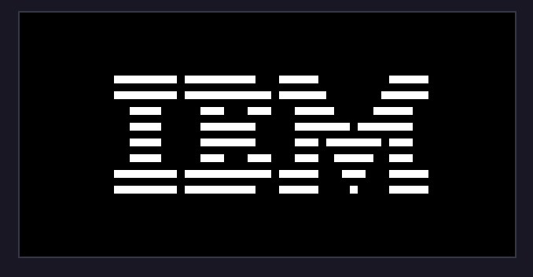
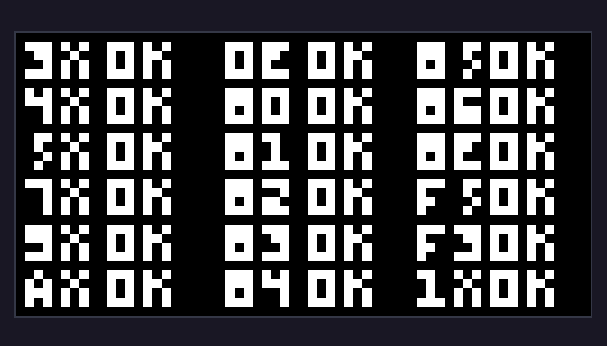

# EMULADOR DO INTERPRETADOR CHIP-8

um projeto pessoal que tinha como objetivo saber como era feitos emuladores e como as coisas funcionavam por debaixo dos panos.

## TECNOLOGIAS 
- C++
- Makefile
- SDL2 (para o grafico)

PRINTS

